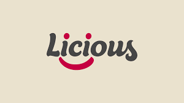

<div align="center">
  
</div>

<div align="center">
  <a href="https://www.linkedin.com/in/ajayj02">
    
  </a>
  &nbsp;
  <a href="https://github.com/ajayj02">
    
  </a>
  &nbsp;
  
</div>

<br/>

<!-- ═══════════════════════════════════════════════════════════ -->

<h2>🧑‍💻 About Me</h2>

<table>
  <tr>
    <td>

```javascript
const ajay = {
    role: "Fullstack Engineer (Frontend Heavy)",
    location: "India",
    currentCompany: "Deloitte USI",
    experience: "4+ years",
    focus: [
        "Performance Optimization",
        "Scalable UI Architecture",
        "System Design"
    ],
    funFact: "I measure success in Lighthouse scores 💯"
};
```

  </td>
    <td align="center">
      
    </td>
  </tr>
</table>

- 🔭 Currently building enterprise-grade applications at **Deloitte USI**
- ⚡ Passionate about **Web Performance** & **Core Web Vitals**
- 🧠 Deep into **React.js**, **Next.js**, and **Node.js** ecosystems
- 🚀 Experienced with event-driven architectures using **Kafka**
- 📊 Data pipeline experience with **Snowflake**

<br/>

<!-- ═══════════════════════════════════════════════════════════ -->

<h2>🏢 Work History</h2>

<table align="center">
  <tr>
    <td align="center" width="300">
      
      <br /><br />
      <b>Deloitte USI</b>
      <br />
      <code>Software Engineer 2</code>
      <br /><br />
      <sub>Mar 2025 — Present</sub>
      <br />
      
    </td>
    <td align="center" width="300">
      
      <br /><br />
      <b>Licious</b>
      <br />
      <code>SDE-2</code>
      <br /><br />
      <sub>Jan 2025 — Mar 2025</sub>
      <br />
      
    </td>
    <td align="center" width="300">
      
      <br /><br />
      <b>Accenture</b>
      <br />
      <code>Software Engineer</code>
      <br /><br />
      <sub>Nov 2021 — Jan 2025</sub>
      <br />
      
    </td>
  </tr>
  <tr>
    <td align="center">
      <sub>Enterprise Applications<br/>Consulting &amp; Technology</sub>
    </td>
    <td align="center">
      <sub>Frontend Performance<br/>Consumer Tech</sub>
    </td>
    <td align="center">
      <sub>Fullstack Development<br/>Client Delivery</sub>
    </td>
  </tr>
</table>

<div align="center">
<pre>
Nov 2021                          Jan 2025   Mar 2025          Present
   ├──────── Accenture ──────────────┤├ Licious ┤├── Deloitte USI ──▶
   │       Software Engineer         ││  SDE-2  ││    SE-2
   │         ~3 years                ││  ~2 mo  ││   Current
</pre>
</div>

<br/>

<!-- ═══════════════════════════════════════════════════════════ -->

<h2>🛠️ Tech Stack</h2>

<div align="center">

  <h3>Frontend</h3>
  
  
  
  
  
  
  

  <h3>Backend</h3>
  
  
  
  

  <h3>Data &amp; Database</h3>
  
  
  

  <h3>Tools &amp; DevOps</h3>
  
  
  

</div>

<br/>

<!-- ═══════════════════════════════════════════════════════════ -->

<h2>📊 GitHub Stats &amp; Activity</h2>

<div align="center">
  <a href="https://github.com/ajayj02">
    
  </a>
  <a href="https://github.com/ajayj02">
    
  </a>
</div>

<br/>

<div align="center">
  <a href="https://github.com/ajayj02">
    
  </a>
</div>

<br/>

<!-- ═══════════════════════════════════════════════════════════ -->

<h2>🏆 GitHub Trophies</h2>

<div align="center">
  <a href="https://github.com/ajayj02">
    
  </a>
</div>

<br/>

<!-- ═══════════════════════════════════════════════════════════ -->

<h2>📈 Skill Proficiency</h2>

```text
React.js        ████████████████████████░░   95%
Next.js         ███████████████████████░░░   90%
JavaScript/TS   ████████████████████████░░   95%
Node.js         ██████████████████████░░░░   85%
NestJS          ████████████████████░░░░░░   80%
Express.js      ██████████████████████░░░░   85%
Performance     ████████████████████████░░   95%
Kafka           ██████████████████░░░░░░░░   70%
Snowflake       ████████████████░░░░░░░░░░   65%
System Design   ██████████████████████░░░░   85%
```

<br/>

<!-- ═══════════════════════════════════════════════════════════ -->

<h2>🐍 Contribution Snake</h2>

<div align="center">
  <picture>
    <source media="(prefers-color-scheme: dark)" srcset="https://raw.githubusercontent.com/ajayj02/ajayj02/output/github-snake-dark.svg" />
    <source media="(prefers-color-scheme: light)" srcset="https://raw.githubusercontent.com/ajayj02/ajayj02/output/github-snake.svg" />
    
  </picture>
</div>

<br/>

> ⬆️ <b>Snake not showing?</b> You need to set up a GitHub Action in your <code>ajayj02/ajayj02</code> profile repo.<br/>
> Create the file <code>.github/workflows/snake.yml</code> with the workflow below, then push it. The snake will auto-generate.

<details>
<summary>📋 Click to see the GitHub Action workflow</summary>

```yaml
name: Generate Snake

on:
  schedule:
    - cron: "0 0 * * *"  # runs daily
  workflow_dispatch:

jobs:
  build:
    runs-on: ubuntu-latest
    steps:
      - uses: Platane/snk@v3
        with:
          github_user_name: ajayj02
          outputs: |
            dist/github-snake.svg
            dist/github-snake-dark.svg?palette=github-dark

      - uses: crazy-max/ghaction-github-pages@v3.1.0
        with:
          target_branch: output
          build_dir: dist
        env:
          GITHUB_TOKEN: ${{ secrets.GITHUB_TOKEN }}
```

</details>

<br/>

<!-- ═══════════════════════════════════════════════════════════ -->

<div align="center">
  
</div>
